# Speed Hackathon LT
+++
## スピードアップしたいサイト
遺伝子ダイエット（記事）  
https://top.dhc.co.jp/shop/ad/sph/idenshi/adv/index_n_basaj.html  
をAMPにするためにやってきました。
+++
### Score
始める前のスコア
+++
Develop server
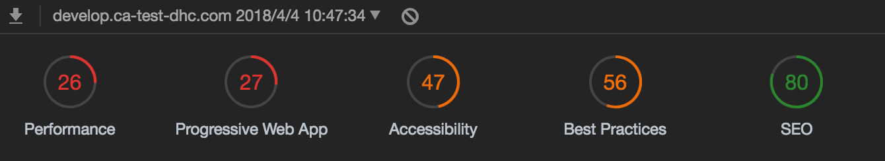

<!-- DHC Server
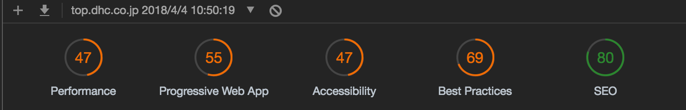 -->

<!-- section -->
+++
# AMP
+++
### まずはAMPで書いてみることに。
+++
とりあえずAMPの書き方にした結果
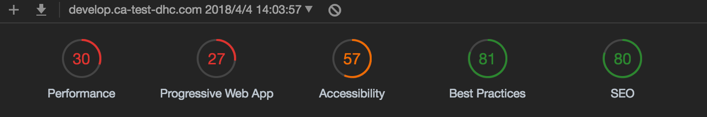
+++
### 嫌な予感・・・
そもそも・・・

+++
### Shift-jis！
クライアントの環境がshift-jisでした。。。
(；´Д｀)

+++
UTF-8
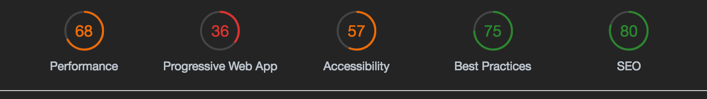

+++
Image min
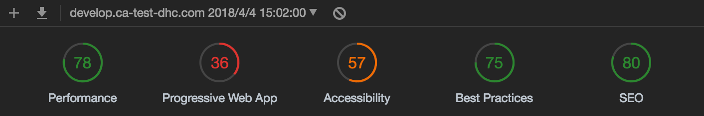

+++
canonical
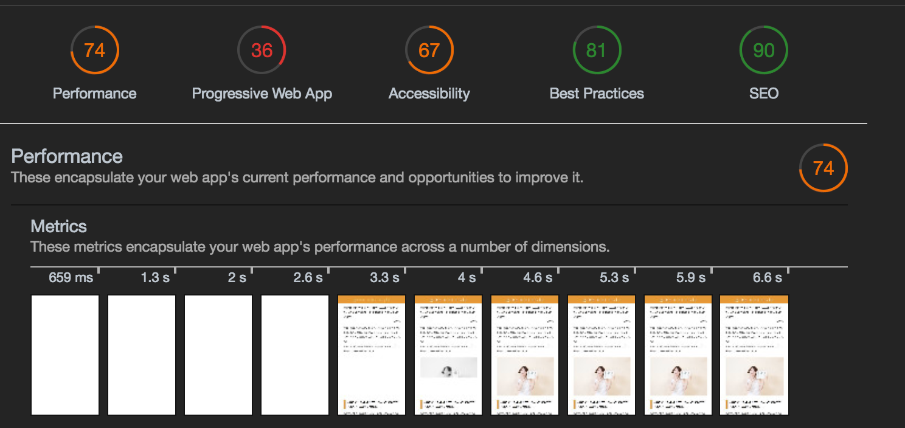

+++
# NOTO FONT (；´∀｀)

+++
Noto fontをはずす
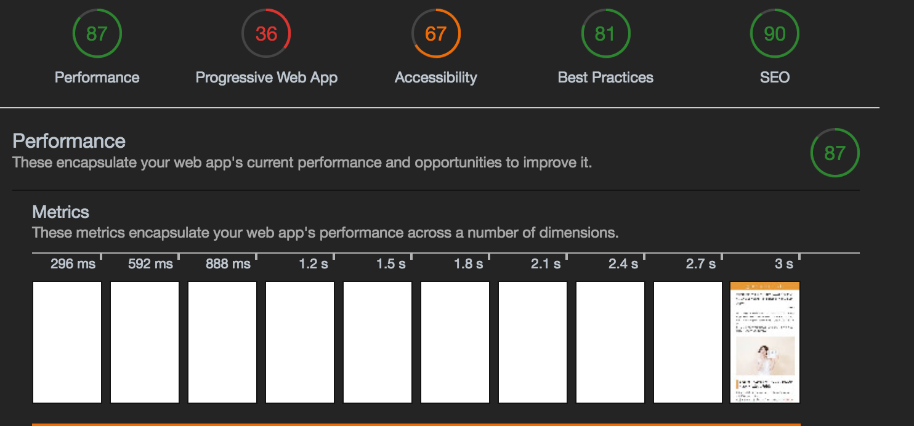

+++
# SPEED　HACK
+++
AMPで改善した箇所を継承しつつ、元の仕様に戻す
+++
スピードハックしただけのやつ
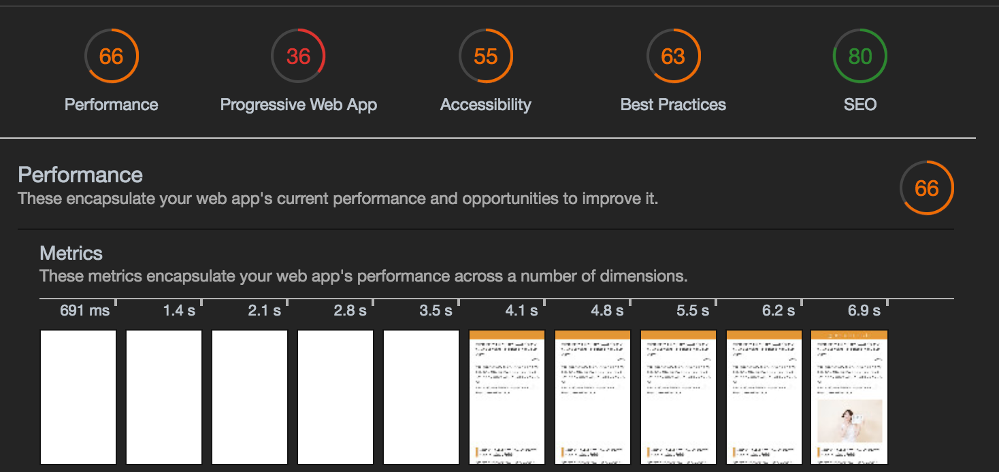

font外した
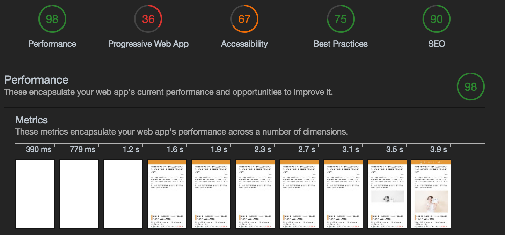
+++
font外した

+++
# 結果
+++
### Speed hackとAMP
Speed hack

AMP

+++

+++
結果的にSpeed hackの方がスコアは良かった。

+++
### パフォーマンスを見比べる
+++

SPD
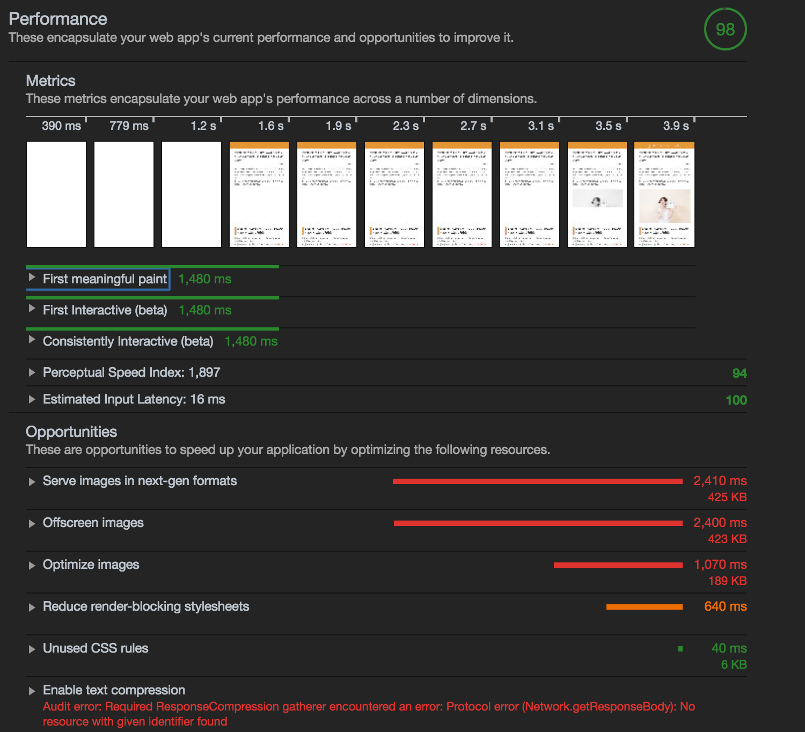

AMP
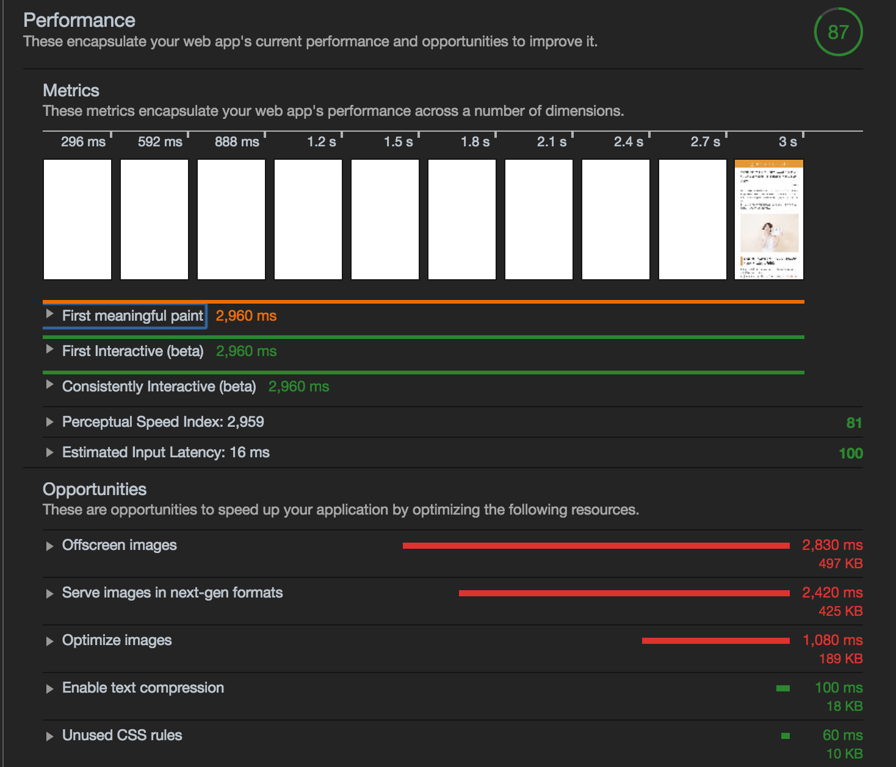

+++
AMP

First meaningful paintに大きな差ができた。

+++
# 最後に
+++
### 大変だったこと
pug, sass
+++
### 良かったこと
Light House, Web Page Test
+++
# 数値化できるって素晴らしい！
さぁ、あとは説得するだけだぜ！
